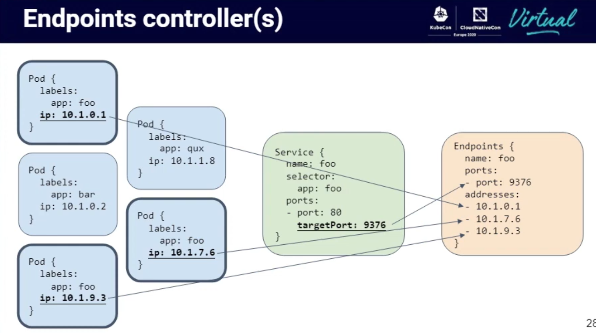

# Networking

https://github.com/kubernetes/community/blob/master/contributors/design-proposals/network/networking.md

These are the four distinct network [problems](https://kubernetes.io/docs/concepts/cluster-administration/networking/) inside a cluster:

1. Highly-coupled container-to-container communications: this is solved by Pods and localhost communications.
2. Pod-to-Pod communications: this is the primary focus of this document.
3. Pod-to-Service communications: this is covered by services.
4. External-to-Service communications: this is covered by services.

Dynamic port allocation brings a lot of complications to the system - every application has to take ports
as flags, the API servers have to know how to insert dynamic port numbers into configuration blocks, services
have to know how to find each other.

Every POD gets it's own IP address. This means you do not need to explicitly create links between Pods and you
almost never need to deal with mapping containers ports to host ports.

All Pods can reach all other Pods, across Nodes.

## Kernel namespaces and networking

The IP per Pod approach is implemented by the runtime, but uses [kernel namespaces](https://blog.scottlowe.org/2013/09/04/introducing-linux-network-namespaces/)
with this you can have different and separated instances of the network interfaces and routing tables that operate
independent of each other.

You can bind a physical interface to a virtual ethernet interface, and use the virtual one in your network namespace.

```
ip link add veth0 type veth peer name veth1
ip link set veth1 netns <namespace>
ip netns exec blue ip addr add 10.1.1.1/24 dev veth1
ip netns exec blue ip link set dev veth1 up
```

## CNI and Pods network

net-script.conf

### ipam configuration

### DHCP
### host-local
### Kubelet CNI

## CoreDNS

## Services

A very good descriptions on how Pod and Services are binding to Endpoints and how this
proxy can keep the reliability of connections on Node or Pod downtime.



from [Kubernetes Networking Intro and Deep-Dive - Bowei Du & Tim Hockin](https://www.youtube.com/watch?v=tq9ng_Nz9j8)

## Ingress

### Default nginx ingress

Deployment spec

### Ingress controllers
