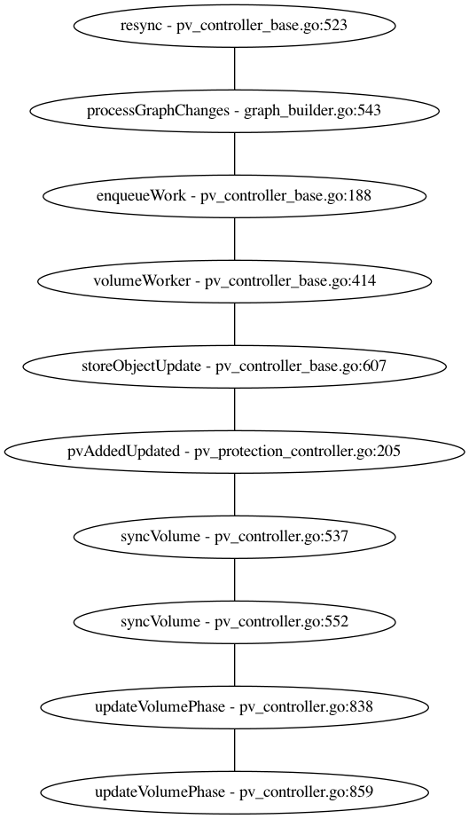
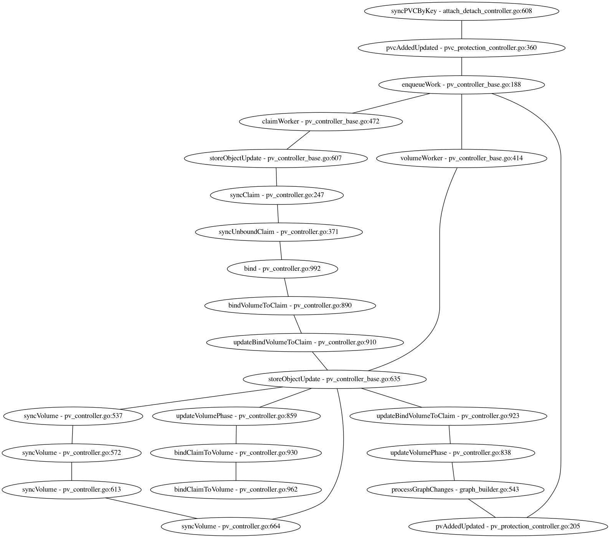

## PersistentVolume (PV)

A piece of storage in the cluster that has been provisioned by an admin or dynamically
provisioned using StorageClass.

This API object captures the details of the implementation of the storage, be that NFS, iSCSI,
or a cloud-provider-specific storage system.

The master part responsible for keeping handling PV related objects is the kube-controller-manager,
in the Controller initialization part you can see the Volume binder controller being started:

```
controllers["persistentvolume-binder"] = startPersistentVolumeBinderController
```

The new controller from pv_controller_base.go start the informers, enqueuing the
necessary new objects when they arrive in the cluster, they have infromers
for Claims and PV. Run is in the same file, and starts goroutines to wait and consume from the
queue in a pre-defined resync period.

The first loop after enabling -v=5 in the /etc/kubernetes/manifests/kube-controller-manager.yaml,



[PVProtectionController](https://kubernetes.io/docs/concepts/storage/persistent-volumes/#storage-object-in-use-protection)
is the first to see it, the protection feature is to ensure that PVCs in active use
by a Pod and PersistentVolume (PVs) that are bound to PVCs are not removed from the system.

The graph builder is the GC, storeObjectUpdate updates given cache with a new object version from Informer
callback, and the volume worker can update the volume and set it to *Available* from the "Pending".

```
22:04:14.902810       1 pv_controller_base.go:523] resyncing PV controller
22:04:16.822829       1 graph_builder.go:543] GraphBuilder process object: v1/PersistentVolume, namespace , name pv1, uid 057c5579-23d7-4e77-96e1-5b1ad408f959, event type add
22:04:16.829151       1 pv_controller_base.go:188] enqueued "pv1" for sync
22:04:16.829347       1 pv_controller_base.go:414] volumeWorker[pv1]
22:04:16.829412       1 pv_controller_base.go:607] storeObjectUpdate: adding volume "pv1", version 315194
22:04:16.829535       1 pv_protection_controller.go:205] Got event on PV pv1
22:04:16.838755       1 pv_controller.go:537] synchronizing PersistentVolume[pv1]: phase: Pending, bound to: "", boundByController: false
22:04:16.839145       1 pv_controller.go:552] synchronizing PersistentVolume[pv1]: volume is unused
22:04:16.839367       1 pv_controller.go:838] updating PersistentVolume[pv1]: set phase Available
22:04:16.870318       1 pv_controller.go:859] volume "pv1" entered phase "Available"
```

## Provisioning

### Static

A cluster admin creates a number of PVs manually

### Dynamic

When none of the static PVs the administrator created match a user's PVC, the cluster
may try to dynamically provision a volume specially for the PVC, this is based on StorageClasses

## Binding

Having a PVC with specific amount of storage requested and with certain access mode,
a control loop in the master watches for new PVCs, find a matching PV (if possible),
and binds them together, If a PV was dynamically provisioned for a new PVC, the loop will
always bind that PV to the PVC.

Once bound, the PVC binds are exclusive, regardless of how they were bound. A PVC to PV binding is 1-1 mapping,
 sing a ClaimRef which is a bi-derecional binding between the PV and the PVC.

## Access modes

* ReadWriteOnce -- the volume can be mounted as read-write by a single node
* ReadOnlyMany -- the volume can be mounted read-only by many nodes
* ReadWriteMany -- the volume can be mounted as read-write by many nodes

[Phases explanation](https://kubernetes.io/docs/concepts/storage/persistent-volumes/#persistent-volumes)

* Available - a free resource that is not yet bound to a claim
* Bound - the volume is bound to a claim
* Released - the claim has been deleted, but the resource is not yet reclaimed by the cluster
* Failed - the volume has failed its automatic reclamation

## PersistentVolumeClaim (PVC)

PVC Is a request for storage by a user, it's similar to a Pod. Pod consumer node resources
and PVCs consume PV resources. Claims can request specific size and access modes
(ReadWriteOnce, ReadOnlyMany, ReadWriteMany).

Pods use claims as volumes. The cluster inspect the claim to find the bound volume and
mounts that volume for a Pod.

If the user delete the PVC in active use by a Pod, the PVC is not removed immediately,
if the PV is deleted the PVC is not removed immediately.

### Retain Policy

Retain reclaim policy allows for manual reclamation of the resource,
when the PVC is deleted, the PV still exists and volume is considered "released".

## Delete and Recycle clean up the PV

Pre-bind without automatic matching is available, through the ClaimRef

### Binding logs

To start lets create a new PVC bounded to the PV, this is more verbose, because
we have both binding and PVC create logs.

Again the PVC in bought to the informer cache and processed by the PVC worker, syncClaim
calls syncUnboundClaim based on the annotation of the object, and find the best match for the
PVC, PVC at this point is Pending but the PV is available.

```
22:13:14.604842       1 attach_detach_controller.go:608] syncPVCByKey[default/pvc1]
22:13:14.605899       1 pvc_protection_controller.go:360] Got event on PVC default/pvc1
22:13:14.605908       1 pv_controller_base.go:188] enqueued "default/pvc1" for sync
22:13:14.605973       1 pv_controller_base.go:472] claimWorker[default/pvc1]
22:13:14.606269       1 pv_controller_base.go:607] storeObjectUpdate: adding claim "default/pvc1", version 316750
22:13:14.606343       1 pv_controller.go:247] synchronizing PersistentVolumeClaim[default/pvc1]: phase: Pending, bound to: "", bindCompleted: false, boundByController: false
22:13:14.608988       1 pv_controller.go:371] synchronizing unbound PersistentVolumeClaim[default/pvc1]: volume "pv1" found: phase: Available, bound to: "", boundByController: false
22:13:14.609796       1 pv_controller.go:992] binding volume "pv1" to claim "default/pvc1"
22:13:14.609811       1 pv_controller.go:890] updating PersistentVolume[pv1]: binding to "default/pvc1"
22:13:14.655861       1 pv_controller.go:910] claim "default/pvc1" bound to volume "pv1"
22:13:14.667075       1 pv_controller_base.go:635] storeObjectUpdate updating volume "pv1" with version 316751
22:13:14.667108       1 pv_controller.go:923] updating PersistentVolume[pv1]: bound to "default/pvc1"
22:13:14.667114       1 pv_controller.go:838] updating PersistentVolume[pv1]: set phase Bound
22:13:14.669187       1 graph_builder.go:543] GraphBuilder process object: v1/PersistentVolume, namespace , name pv1, uid 057c5579-23d7-4e77-96e1-5b1ad408f959, event type update
22:13:14.669616       1 pv_protection_controller.go:205] Got event on PV pv1
22:13:14.669644       1 pv_controller_base.go:188] enqueued "pv1" for sync
22:13:14.669657       1 pv_controller_base.go:414] volumeWorker[pv1]
22:13:14.669665       1 pv_controller_base.go:635] storeObjectUpdate updating volume "pv1" with version 316751
22:13:14.669764       1 pv_controller.go:537] synchronizing PersistentVolume[pv1]: phase: Available, bound to: "default/pvc1 (uid: 7f77e494-447a-498e-a02d-6dc17f42ffc0)", boundByController: true
22:13:14.669791       1 pv_controller.go:572] synchronizing PersistentVolume[pv1]: volume is bound to claim default/pvc1
22:13:14.669801       1 pv_controller.go:613] synchronizing PersistentVolume[pv1]: claim default/pvc1 found: phase: Pending, bound to: "", bindCompleted: false, boundByController: false
22:13:14.669806       1 pv_controller.go:664] synchronizing PersistentVolume[pv1]: volume not bound yet, waiting for syncClaim to fix it
22:13:14.671932       1 pv_controller_base.go:635] storeObjectUpdate updating volume "pv1" with version 316752
22:13:14.672063       1 pv_controller.go:859] volume "pv1" entered phase "Bound"
22:13:14.672134       1 pv_controller.go:930] updating PersistentVolumeClaim[default/pvc1]: binding to "pv1"
22:13:14.672179       1 pv_controller.go:962] volume "pv1" bound to claim "default/pvc1"
22:41:45.144401       1 pv_controller.go:1019] volume "pv1" status after binding: phase: Bound, bound to: "default/pvc1 (uid: eeab4424-b092-46b5-97d6-ef9dbfb3642a)", boundByController: true
22:41:45.144408       1 pv_controller.go:1020] claim "default/pvc1" status after binding: phase: Bound, bound to: "pv1", bindCompleted: true, boundByController: true
```



After the operation the final state is *Bound* for both PV and PVC. The last operation is to mount
the volume in a Node worker via PodSpec.

```
 kubectl get pv,pvc
NAME                   CAPACITY   ACCESS MODES   RECLAIM POLICY   STATUS   CLAIM          STORAGECLASS    REASON   AGE
persistentvolume/pv1   10Mi       RWO            Retain           Bound    default/pvc1   local-storage            35m

NAME                         STATUS   VOLUME   CAPACITY   ACCESS MODES   STORAGECLASS    AGE
persistentvolumeclaim/pvc1   Bound    pv1      10Mi       RWO            local-storage   26m
```

## Pod volume mount

```
22:42:56.404938       1 pvc_protection_controller.go:409] Enqueuing PVCs for Pod default/task-pv-pod (UID=a77bc73b-40d8-4b67-a94d-ed6132862306)
22:42:56.404998       1 pvc_protection_controller.go:156] Processing PVC default/pvc1                                                                         
22:42:56.405100       1 pvc_protection_controller.go:159] Finished processing PVC default/pvc1 (29.134µs)
22:42:56.406281       1 taint_manager.go:400] Noticed pod update: types.NamespacedName{Namespace:"default", Name:"task-pv-pod"}                               
22:42:57.985342       1 disruption.go:395] updatePod called on pod "task-pv-pod"
22:42:57.985362       1 disruption.go:458] No PodDisruptionBudgets found for pod task-pv-pod, PodDisruptionBudget controller will avoid syncing.
22:42:57.985366       1 disruption.go:398] No matching pdb for pod "task-pv-pod"
```

Now it's time for *Kubelet* to check the spec and act when the Pod is scheduled for the node:

The Reconciler runs a periodic loop to reconcile the desired state of the world
with the actual state of the world by triggering attach, detach, mount, and unmount operations.
 
The *rc.mountAttachVolumes()* mount the required volumes. This function could also trigger
attach if kubelet is responsible for attaching volumes.

```
23:34:34.838197   84855 desired_state_of_world_populator.go:553] Extracted volumeSpec (pv1) from bound PV (pvName "pv1") and PVC (ClaimName "default"/"pvc1" pvcUID eeab4424-b092-46b5-97d6-ef9dbfb3642a)
23:34:34.838582   84855 desired_state_of_world_populator.go:344] Added volume "task-pv" (volSpec="pv1") for pod "9787497b-825f-46dd-93dd-5e0aae257fea" to desired state.
23:34:34.838758   84855 desired_state_of_world_populator.go:344] Added volume "default-token-b4xnr" (volSpec="default-token-b4xnr") for pod "9787497b-825f-46dd-93dd-5e0aae257fea" to desired state.
23:34:34.898702   84855 reconciler.go:211] Starting operationExecutor.VerifyControllerAttachedVolume for volume "pv1" (UniqueName: "kubernetes.io/host-path/9787497b-825f-46dd-93dd-5e0aae257fea-pv1") pod "task-pv-pod" (UID: "9787497b-825f-46dd-93dd-5e0aae257fea")
23:34:34.999666   84855 reconciler.go:254] Starting operationExecutor.MountVolume for volume "default-token-b4xnr" (UniqueName: "kubernetes.io/secret/9787497b-825f-46dd-93dd-5e0aae257fea-default-token-b4xnr") pod "task-pv-pod" (UID: "9787497b-825f-46dd-93dd-5e0aae257fea")
23:34:35.002686   84855 reconciler.go:269] operationExecutor.MountVolume started for volume "pv1" (UniqueName: "kubernetes.io/host-path/9787497b-825f-46dd-93dd-5e0aae257fea-pv1") pod "task-pv-pod" (UID: "9787497b-825f-46dd-93dd-5e0aae257fea")
23:34:35.004163   84855 operation_generator.go:663] MountVolume.SetUp succeeded for volume "pv1" (UniqueName: "kubernetes.io/host-path/9787497b-825f-46dd-93dd-5e0aae257fea-pv1") pod "task-pv-pod" (UID: "9787497b-825f-46dd-93dd-5e0aae257fea")
23:34:36.015477   84855 volume_manager.go:403] All volumes are attached and mounted for pod "task-pv-pod_default(9787497b-825f-46dd-93dd-5e0aae257fea)"
```

Basically the populatorLoop list all the pods running in that Kubelet and process the Pods Volumes,
AddPodToVolume is used, adding the given pod to the given volume in the cache and indicates
the specified pod should mount the specified volume.

The mount operation is made by tehe reconciler via the operationExecutor.AttachVolume, it finds the correct
VolumePlugin to do the *attach* operation (volume_attach). Eventually the mount Volume manager will sync the
final status.