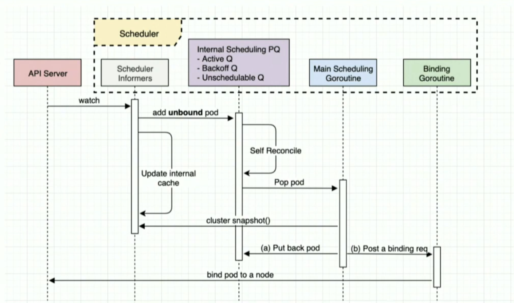

# Pod Scheduler

The main flow of the pod scheduler is represented on this diagram from this [presentation](https://videos.cncf.io/search/scheduler/video/rym-44Co2Js) by @Huang-Wei

Basically the scheduler informer listen for new *unbound* pod (ones without node binding), the main scheduling 
goroutine consume the queues and though the framework finds the best node and bind it to the pod, so the Kubelet
can watch for it's owned Pods.

Nodes that meet the scheduling requirements for a Pod are called feasible nodes. The scheduler finds feasible nodes
for a Pod and then runsa set of functions to score the feasible Nodes and picks a Node with the highest score among
the feasible ones to run the Pod in a process called *binding*.

The scheduler selects a node for the pod in a 2-step operation:

1. Filtering - Predicates: finds the set of Nodes where it's feasible to schedule the Pod. AKA  
2. Scoring - Priorities: the scheduler ranks the remaining nodes to choose the most suitable Pod placement.

There are two supported ways to configure the filtering and scoring behaviour of the scheduler:

1. Scheduling Policies - Allow you to configure Predicates for filtering and Priorities for scoring
2. Scheduling Profiles - Allow you to configure Plugins that implement different scheduling staging, including
QueueSort, Filter, Score, Bind, Reserve, Permit and others.

## Scheduling Framework

Is a pluggable architecture for Kubernetes Scheduler that makes scheduler customizations easy. Adds a new set
of "plugin" APIs to the existing scheduler. Plugins are compiled into the scheduler.

It defines a few extension points. Scheduler plugins register to be invoked at one or more extension points.

