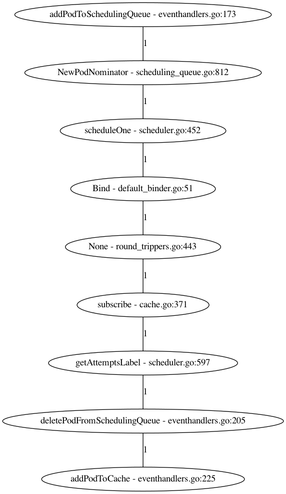
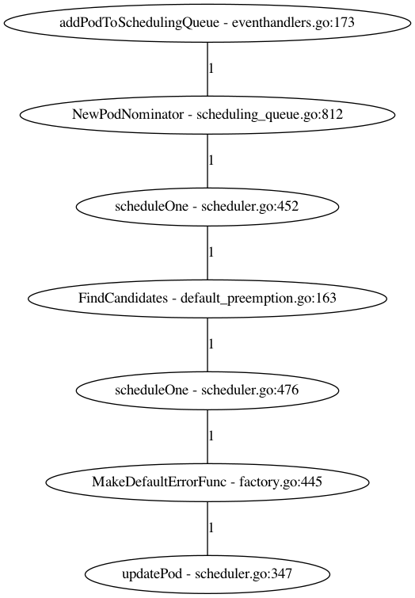

# Pod Scheduler

The main flow of the pod scheduler is represented on this diagram from this [presentation](https://videos.cncf.io/search/scheduler/video/rym-44Co2Js) by @Huang-Wei


Basically the scheduler informer listen for new *unbound* pod (ones without node binding), the main scheduling 
goroutine consume the queues and though the framework finds the best node and bind it to the pod, so the Kubelet
can watch for it's owned Pods.

Still accordingly to this [article](https://developer.ibm.com/technologies/containers/articles/creating-a-custom-kube-scheduler):

1. The default scheduler starts up according to the parameters given.
2. It watches on apiserver, and puts pods where its spec.nodeName
 is empty into its internal scheduling queue.
3. It pops out a pod from the scheduling queue and starts a standard scheduling cycle.
4. It retrieves “hard requirements” (like cpu/memory requests, 
 nodeSelector/nodeAffinity) from the pod’s API spec. Then the predicates phase occurs
 where it calculates to give a node candidates list which satisfies those requirements.
5. It retrieves “soft requirements” from the pod’s API spec and also applies some default soft “policies” (like the pods prefer to be more packed or scattered across the nodes). It finally gives a score for each candidate node, and picks up the final winner with the highest score.
6. It talks to the apiserver (by issuing a bind call) and sets spec.nodeName to indicate 
 the node that this pod should be scheduled to.


Nodes that meet the scheduling requirements for a Pod are called feasible nodes. The scheduler finds feasible nodes
for a Pod and then runsa set of functions to score the feasible Nodes and picks a Node with the highest score among
the feasible ones to run the Pod in a process called *binding*.

The scheduler selects a node for the pod in a 2-step operation:

1. Filtering - Predicates: finds the set of Nodes where it's feasible to schedule the Pod. AKA  
2. Scoring - Priorities: the scheduler ranks the remaining nodes to choose the most suitable Pod placement.

There are two supported ways to configure the filtering and scoring behaviour of the scheduler:

1. Scheduling Policies - Allow you to configure Predicates for filtering and Priorities for scoring
2. Scheduling Profiles - Allow you to configure Plugins that implement different scheduling staging, including
QueueSort, Filter, Score, Bind, Reserve, Permit and others.


## Scheduling

After creating a new pod in the cluster, and setting *-v=5* for the scheduler,
the following logs are observed.

```
16:39:40.775738       1 eventhandlers.go:173] add event for unscheduled pod default/nginx
16:39:40.775825       1 scheduling_queue.go:812] About to try and schedule pod default/nginx
16:39:40.775833       1 scheduler.go:452] Attempting to schedule pod: default/nginx
16:39:40.776663       1 default_binder.go:51] Attempting to bind default/nginx to kind-worker
16:39:40.796035       1 round_trippers.go:443] POST https://172.18.0.4:6443/api/v1/namespaces/default/pods/nginx/binding 201 Created in 9 milliseconds
16:39:40.796946       1 cache.go:371] Finished binding for pod fbebbe1a-7474-4b82-8ada-91c211d9c510. Can be expired.
16:39:40.797553       1 scheduler.go:597] "Successfully bound pod to node" pod="default/nginx" node="kind-worker" evaluatedNodes=3 feasibleNodes=2
16:39:40.799616       1 eventhandlers.go:205] delete event for unscheduled pod default/nginx
16:39:40.799910       1 eventhandlers.go:225] add event for scheduled pod default/nginx
```



## Taints and toleration

The cluster has 2 workers created with Kind, a taint is placed on both
```
kubectl taint node  kind-worker kind-worker2 area=1:NoSchedule
```

```
16:55:48.474542       1 eventhandlers.go:173] add event for unscheduled pod default/nginx
16:55:48.474585       1 scheduling_queue.go:812] About to try and schedule pod default/nginx
16:55:48.474591       1 scheduler.go:452] Attempting to schedule pod: default/nginx
16:55:48.481066       1 default_preemption.go:163] Preemption will not help schedule pod default/nginx on any node.
16:55:48.481216       1 scheduler.go:476] Status after running PostFilter plugins for pod default/nginx: &{2 []}
16:55:48.482094       1 factory.go:445] "Unable to schedule pod; no fit; waiting" pod="default/nginx" err="0/3 nodes are available: 1 node(s) had taint {node-role.kubernetes.io/master: }, that the pod didn't tolerate, 2 node(s) had taint {key: }, that the pod didn't tolerate."
16:55:48.487796       1 scheduler.go:347] Updating pod condition for default/nginx to (PodScheduled==False, Reason=Unschedulable)
```



The Pod is still in Pending, the toleration must be explicit in the Pod:

```
spec:
  containers:
  - image: nginx
    name: nginx
  tolerations:
  - key: "area"
    operator: "Equal"
    value: "1"
    effect: "NoSchedule"
```

## Assigning Pods to a Node

*nodeSelector* and *nodeName* are two direct spec fields used to schedule a Pod to a specific
node. Add the label to a node and set the Node affinity to the Pod:

```
kubectl label nodes kind-worker area=1

spec:
  affinity:
    nodeAffinity:
      requiredDuringSchedulingIgnoredDuringExecution:
        nodeSelectorTerms:
        - matchExpressions:
          - key: area
            operator: In
            values:
            - "1"
```

You should see similar logs:

```
17:28:22.699161       1 round_trippers.go:443] POST https://172.18.0.4:6443/api/v1/namespaces/default/pods/nginx/binding 201 Created in 21 milliseconds
17:28:22.699395       1 cache.go:371] Finished binding for pod 1e424bd4-3c26-4974-8e1c-7cfd5542b26a. Can be expired.
17:28:22.699606       1 scheduler.go:597] "Successfully bound pod to node" pod="default/nginx" node="kind-worker" evaluatedNodes=3 feasibleNodes=1
```

## Scheduling Framework

Is a pluggable architecture for Kubernetes Scheduler that makes scheduler customizations easy. Adds a new set
of "plugin" APIs to the existing scheduler. Plugins are compiled into the scheduler.

It defines a few extension points. Scheduler plugins register to be invoked at one or more extension points.

